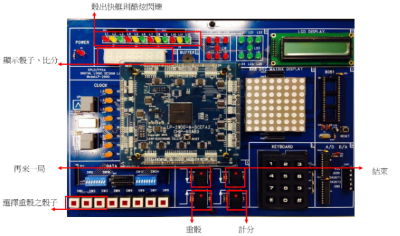

# 快艇骰子（改良版）

數位電路實習專題。在 FPGA 上實作雙人快艇骰子遊戲，開發環境為 Quartus II，目標板為 LP-2900 實驗平台（Cyclone V，5CEFA2F23C8）。

## 遊戲規則

兩位玩家輪流擲三顆骰子，擲出後可選擇部分骰子重擲，最後依組合計分：

- **機會／全選** — 三顆骰子點數相加
- **壓死／快艇** — 三顆點數相同，給予固定高分

兩位玩家各完成一輪後比較分數。

## 功能

- **擲骰** — 以序向邏輯產生 1–6 的骰子點數，放開按鍵時停住
- **選擇重擲** — 以三個資料開關對應三顆骰子，選定後按重骰鍵重新產生點數，最多可重擲兩次
- **計分** — 依骰出的組合判斷採全選或快艇計分，並分別記錄兩位玩家的分數
- **顯示** — 七段顯示器分時多工顯示三顆骰子點數，結算時切換顯示兩位玩家的比分
- **特效** — 骰出快艇時 LED 閃爍
- **流程控制** — 以脈波按鍵控制擲骰、重骰、計分與換玩家，並可選擇繼續下一局或結束

## 硬體配置

| 元件 | 用途 |
|---|---|
| 七段顯示器 ×3 | 顯示骰子點數與玩家分數 |
| 開關 ×3 | 選擇要重擲的骰子，由左至右對應 |
| 按鍵 ×4 | 下一局／結束／確認重骰／計分換人 |
| LED | 快艇特效 |

## 模組

| 檔案 | 說明 |
|---|---|
| `test.bdf` | 頂層原理圖，串接所有模組與 I/O |
| `project_test.vhd` | 骰子計數器，1–6 循環 |
| `SFlagCtrl.vhd` | 重擲控制，記錄哪些骰子已定住並決定何時換玩家 |
| `score.vhd` | 計分邏輯，判斷全選或快艇 |
| `CountLight.vhd` | 七段顯示器分時多工 |
| `light_VHDL.vhd` | 3-bit 轉七段顯示解碼 |
| `clk_gen.bdf` | 時脈產生器，分出 1KHz／100Hz／10Hz／1Hz |
| `debounce_g.bdf` | 按鍵消除彈跳 |
| `div10_t.bdf`、`Dff_circuit.bdf` | 除十電路、D 型正反器 |

## 開發環境

Quartus II，目標晶片 Cyclone V 5CEFA2F23C8，實驗平台為 LP-2900 CPLD 邏輯設計實驗板。

## 示意圖

